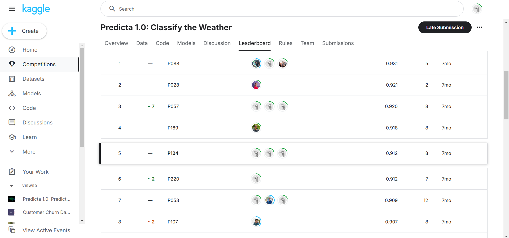
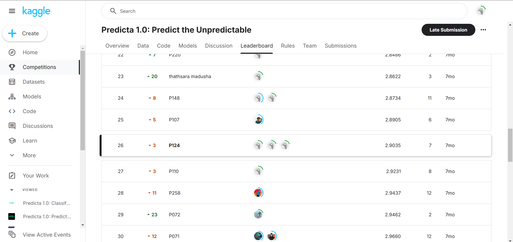
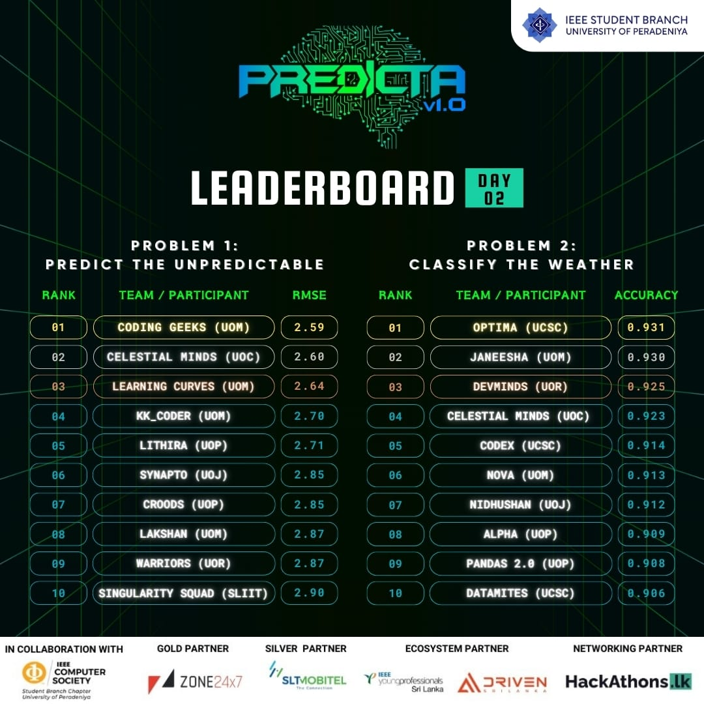
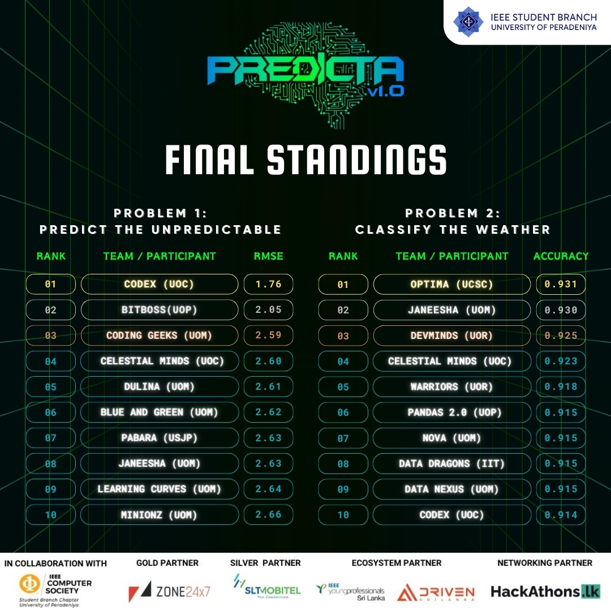

# Predicta v1.0 

## Overview
This repository contains the solution to the competition **Predicta v1.0**, hosted by the IEEE Student Branch of University of Peradeniya. Our team, **Warriors (P124)**, tackled two main tasks:

1. **Time Series Prediction**: Predict average temperatures for the first week of 2019 across 100 cities using historical weather data (2014-2018).
2. **Weather Classification**: Classify weather conditions (e.g., sunny, rainy) for each day based on historical data.

The solution leverages **LSTM** for time series forecasting and an ensemble of **Random Forest**, **Gradient Boosting**, and **XGBoost** classifiers for weather condition classification.

## Methodology

### Problem 1: Time Series Prediction
- Used **LSTM** to predict average temperatures for cities in the first week of 2019.
- Preprocessed data, engineered features, and optimized the model to improve predictions.

### Problem 2: Weather Classification
- Employed an ensemble model (Random Forest, Gradient Boosting, XGBoost) for classifying weather conditions.
- Focused on preprocessing, feature engineering, and hyperparameter tuning to enhance model performance.

## Competition Stats

